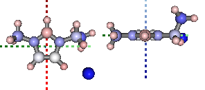
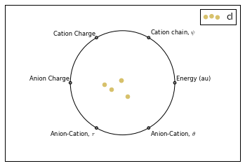
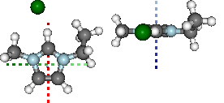
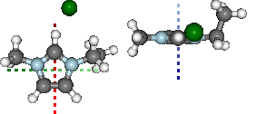

#Python Gaussian Analysis Tool (pygauss)

Pygauss is designed to be an API for parsing one or more input/output files from a [Gaussian](http://www.gaussian.com/) quantum chemical computation and provide functionality to assess  **molecular geometry** and **electronic distribution** both visually and quantitatively.

It is built on top of the [cclib](http://cclib.github.io/)/[chemlab](http://chemlab.readthedocs.org/en/latest/index.html)/[chemview](http://chemview.readthedocs.org/en/latest/) suite of packages and python scientific stack and is primarily designed to be used interactively in the [IPython Notebook](http://ipython.org/notebook.html) (within which this readme has been written). As shown below, a molecular optimisation can be assesed individually (much like in [gaussview](http://www.gaussian.com/g_prod/gv5b.htm)), but also as part of a group. The advantages of this package are then:

- Faster, more efficient analysis
- Reproducible analysis
- Trend analysis

Detail instillation...

    pip install pygauss
    
    conda install -c http://conda.binstar.org/gabrielelanaro chemlab

You should then be able to start an ipython notebook...

    from IPython.display import display
    %matplotlib inline
    import pygauss as pg
    folder = pg.get_test_folder()

##Single Molecule Analysis

A *molecule* can be created containg data about the inital geometry, optimisation process and analysis of the final configuration.

    mol = pg.molecule.Molecule(folder,
                    init_fname='CJS1_emim-cl_B_init.com', 
                    opt_fname=['CJS1_emim-cl_B_6-311+g-d-p-_gd3bj_opt-modredundant_difrz.log',
                               'CJS1_emim-cl_B_6-311+g-d-p-_gd3bj_opt-modredundant_difrz_err.log',
                               'CJS1_emim-cl_B_6-311+g-d-p-_gd3bj_opt-modredundant_unfrz.log'],
                    freq_fname='CJS1_emim-cl_B_6-311+g-d-p-_gd3bj_freq_unfrz.log',
                    nbo_fname='CJS1_emim-cl_B_6-311+g-d-p-_gd3bj_pop-nbo-full-_unfrz.log', 
                    alignto=[3,2,1])
    
    #mol.show_initial(active=True)
    display(mol.show_initial(zoom=0.5, rotations=[[0,0,90], [-90, 90, 0]]))
    display(mol.show_optimisation(ball_stick=True, rotations=[[0,0,90], [-90, 90, 0]]))

Basic analysis of optimisation...

    print('Optimised? {0}, Conformer? {1}, Energy = {2} a.u.'.format(
        mol.is_optimised(), mol.is_conformer(), round(mol.get_optimisation_E(units='hartree'),3)))
    ax = mol.plot_optimisation_E(units='hartree')
    ax.get_figure().set_size_inches(3, 2)

    Optimised? True, Conformer? True, Energy = -805.105 a.u.
    

Geometric analysis...

    print 'Cl optimised polar coords from aromatic ring : ({0}, {1},{2})'.format(
        *[round(i, 2) for i in mol.calc_polar_coords_from_plane(20,3,2,1)])
    ax = mol.plot_opt_trajectory(20, [3,2,1])
    ax.set_title('Cl optimisation path')
    ax.get_figure().set_size_inches(4, 3)

    Cl optimised polar coords from aromatic ring : (0.11, -116.42,-170.06)
    

Potential Energy Scan analysis of geometric conformers...

    mol2 = pg.molecule.Molecule(folder, alignto=[3,2,1],
                pes_fname=['CJS_emim_6311_plus_d3_scan.log', 
                           'CJS_emim_6311_plus_d3_scan_bck.log'])   
    ax = mol2.plot_pes_scans([1,4,9,10], rotation=[0,0,90], img_pos='local_maxs', zoom=0.5)
    ax.set_title('Ethyl chain rotational conformer analysis')
    ax.get_figure().set_size_inches(7, 3)

Natural Bond Orbital analysis...

    print '+ve charge centre polar coords from aromatic ring: ({0} {1},{2})'.format(
        *[round(i, 2) for i in mol.calc_nbo_charge_center(3, 2, 1)])
    display(mol.show_nbo_charges(ball_stick=True, axis_length=0.4, 
                                  rotations=[[0,0,90], [-90, 90, 0]]))

    +ve charge centre polar coords from aromatic ring: (0.02 -51.77,-33.15)
    

## Multiple Computations Analysis

a

    analysis = pg.analysis.Analysis(folder)
    df, errors = analysis.add_runs(headers=['Cation', 'Anion', 'Initial'], 
                                   values=[['emim'], ['cl'],
                                           ['B', 'BE', 'BM', 'F', 'FE', 'FM']],
                init_pattern='CJS1_{0}-{1}_{2}_init.com',
                opt_pattern='CJS1_{0}-{1}_{2}_6-311+g-d-p-_gd3bj_opt-modredundant_unfrz.log',
                freq_pattern='CJS1_{0}-{1}_{2}_6-311+g-d-p-_gd3bj_freq_unfrz.log',
                nbo_pattern='CJS1_{0}-{1}_{2}_6-311+g-d-p-_gd3bj_pop-nbo-full-_unfrz.log')
    print 'Read Errors:', errors

    Read Errors: [{'Cation': 'emim', 'Initial': 'FM', 'Anion': 'cl'}]
    

    analysis.add_mol_property('Opt', 'is_optimised')
    analysis.add_mol_property('Energy (au)', 'get_optimisation_E', units='hartree')
    analysis.add_mol_property('Cation chain, $\\psi$', 'calc_dihedral_angle', [1, 4, 9, 10])
    analysis.add_mol_property('Cation Charge', 'calc_nbo_charge', range(1, 20))
    analysis.add_mol_property('Anion Charge', 'calc_nbo_charge', [20])
    analysis.add_mol_property(['Anion-Cation, $r$', 'Anion-Cation, $\\theta$', 'Anion-Cation, $\\phi$'], 
                                   'calc_polar_coords_from_plane', 3, 2, 1, 20)
    analysis.get_table(row_index=['Anion', 'Cation', 'Initial'], 
                       column_index=['Cation', 'Anion', 'Anion-Cation'])

<table border="1" class="dataframe">
  <thead>
    <tr>
      <th></th>
      <th></th>
      <th></th>
      <th colspan="2" halign="left"></th>
      <th colspan="2" halign="left">Cation</th>
      <th>Anion</th>
      <th colspan="3" halign="left">Anion-Cation</th>
    </tr>
    <tr>
      <th></th>
      <th></th>
      <th></th>
      <th>Opt</th>
      <th>Energy (au)</th>
      <th>chain, $\psi$</th>
      <th>Charge</th>
      <th>Charge</th>
      <th>$r$</th>
      <th>$\theta$</th>
      <th>$\phi$</th>
    </tr>
    <tr>
      <th>Anion</th>
      <th>Cation</th>
      <th>Initial</th>
      <th></th>
      <th></th>
      <th></th>
      <th></th>
      <th></th>
      <th></th>
      <th></th>
      <th></th>
    </tr>
  </thead>
  <tbody>
    <tr>
      <th rowspan="5" valign="top">cl</th>
      <th rowspan="5" valign="top">emim</th>
      <th>B</th>
      <td>True</td>
      <td>-805.105</td>
      <td>80.794</td>
      <td>0.888</td>
      <td>-0.888</td>
      <td>0.420</td>
      <td>-123.392</td>
      <td>172.515</td>
    </tr>
    <tr>
      <th>BE</th>
      <td>True</td>
      <td>-805.105</td>
      <td>80.622</td>
      <td>0.887</td>
      <td>-0.887</td>
      <td>0.420</td>
      <td>-123.449</td>
      <td>172.806</td>
    </tr>
    <tr>
      <th>BM</th>
      <td>True</td>
      <td>-805.104</td>
      <td>73.103</td>
      <td>0.874</td>
      <td>-0.874</td>
      <td>0.420</td>
      <td>124.121</td>
      <td>-166.774</td>
    </tr>
    <tr>
      <th>F</th>
      <td>True</td>
      <td>-805.118</td>
      <td>147.026</td>
      <td>0.840</td>
      <td>-0.840</td>
      <td>0.420</td>
      <td>10.393</td>
      <td>0.728</td>
    </tr>
    <tr>
      <th>FE</th>
      <td>True</td>
      <td>-805.117</td>
      <td>85.310</td>
      <td>0.851</td>
      <td>-0.851</td>
      <td>0.417</td>
      <td>-13.254</td>
      <td>-4.873</td>
    </tr>
  </tbody>
</table>

    ax = analysis.plot_radviz_comparison('Anion', columns=range(4, 10))

    kwargs = {'mtype':'optimised', 'align_to':[3,2,1], 
                'rotations':[[0, 0, 90], [-90, 90, 0]],
                'axis_length':0.3}
    def show_groups(df):
        for cat, gf in df.groupby('Category'):
            print 'Category {0}:'.format(cat)
            mols = analysis.yield_mol_images(rows=gf.index.tolist(), **kwargs)
            for mol, row in zip(mols, gf.index.tolist()): 
                print '(row {0})'.format(row)
                display(mol)
    show_groups(analysis.calc_kmean_groups('Anion', 'cl', 4, columns=range(4, 10)))

    Category 0:
    (row 0)
    

    (row 1)
    

    Category 1:
    (row 2)
    

    Category 2:
    (row 3)
    

    Category 3:
    (row 4)
    

